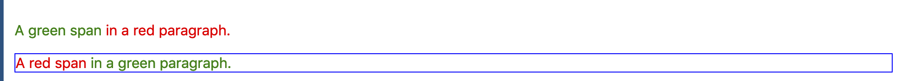
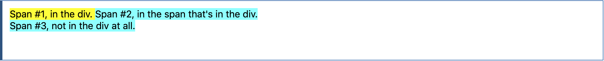
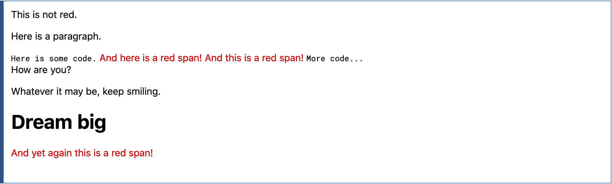
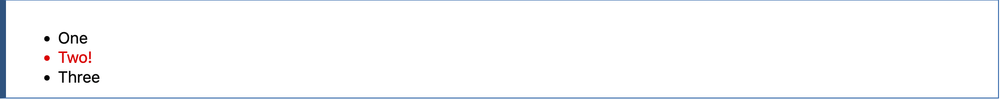
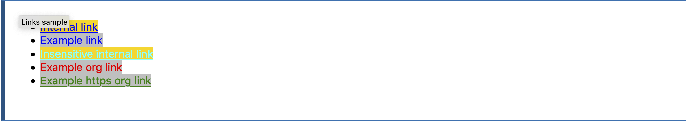
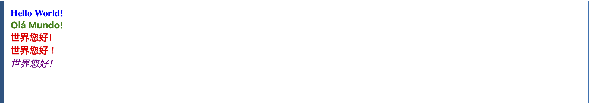
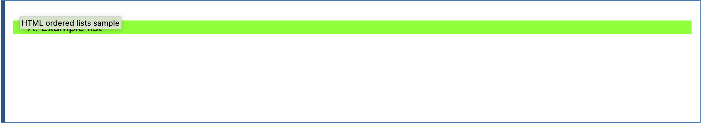

# CSS selectors

## Universal selectors

The CSS **universal selector** (`*`) matches elements of any type.

```css
/* Selects all elements */

* {
  color: green;
}
```

Universal selectors can be namespaced when using [`@namespace`](https://developer.mozilla.org/en-US/docs/Web/CSS/@namespace). This is useful when dealing with documents containing multiple namespaces such as HTML5 with inline SVG or MathML, or XML that mixes multiple vocabularies.

- `ns|*` - matches all elements in namespace _ns_
- `*|*` - matches all elements
- `|*` - matches all elements without any declared namespace

### Syntax

```css
* { style properties }
```

### Examples

#### CSS

```css
* [lang^=en] {
  color: green;
}

*.warning {
  color: red;
}

*#maincontent {
  border: 1px solid blue;
}

.floating {
  float: left
}

/* automatically clear the next sibling after a floating element */
.floating + * {
  clear: left;
}
```

#### HTML

```html
<p class="warning">
  <span lang="en-us">A green span</span> in a red paragraph.
</p>
<p id="maincontent" lang="en-gb">
  <span class="warning">A red span</span> in a green paragraph.
</p>
```

#### Result



### Namespaces

In this example the selector will only match elements in the example namespace.

```css
@namespace example url(http://www.example.com);
example|* { color: blue }
```

## Child combinator

The **child combinator** (`>`) is placed between two CSS selectors. It matches only those elements matched by the second selector that are the direct children of elements matched by the first.

```css
/* List items that are children of the "my-things" list */
ul.my-things > li {
  margin: 2em;
}
```

Elements matched by the second selector must be the immediate children of the elements matched by the first selector. This is stricter than the [descendant combinator](https://developer.mozilla.org/en-US/docs/Web/CSS/Descendant_combinator), which matches all elements matched by the second selector for which there exists an ancestor element matched by the first selector, regardless of the number of "hops" up the DOM.

### Syntax

```css
selector1 > selector2 { style properties }
```

### Examples

#### CSS

```css
span {
  background-color: aqua;
}

div > span {
  background-color: yellow;
}
```

#### HTML

```html
<div>
  <span>Span #1, in the div.
    <span>Span #2, in the span that's in the div.</span>
  </span>
</div>
<span>Span #3, not in the div at all.</span>
```

#### Result



## General sibling combinator

The **general sibling combinator** (`~`) separates two selectors and matches _all iterations_ of the second element, that are following the first element (though not necessarily immediately), and are children of the same parent [element](https://developer.mozilla.org/en-US/docs/Glossary/Element).

```css
/* Paragraphs that are siblings of and
   subsequent to any image */
img ~ p {
  color: red;
}
```

### Syntax

```css
former_element ~ target_element { style properties }
```

### Examples

#### CSS

```css
p ~ span {
  color: red;
}
```

#### HTML

```html
<span>This is not red.</span>
<p>Here is a paragraph.</p>
<code>Here is some code.</code>
<span>And here is a red span!</span>
<span>And this is a red span!</span>
<code>More code...</code>
<div> How are you? </div>
<p> Whatever it may be, keep smiling. </p>
<h1> Dream big </h1>
<span>And yet again this is a red span!</span>
```

#### Result



## Adjacent sibling combinator

The **adjacent sibling combinator** (`+`) separates two selectors and matches the second element only if it _immediately_ follows the first element, and both are children of the same parent [`element`](https://developer.mozilla.org/en-US/docs/Web/API/Element).

```css
/* Paragraphs that come immediately after any image */
img + p {
  font-weight: bold;
}
```

### Syntax

```
former_element + target_element { style properties }
```

### Examples

#### CSS

```css
li:first-of-type + li {
  color: red;
}
```

#### HTML

```html
<ul>
  <li>One</li>
  <li>Two!</li>
  <li>Three</li>
</ul>
```

#### Result



## Attribute selectors

The CSS **attribute selector** matches elements based on the presence or value of a given attribute.

```css
/* <a> elements with a title attribute */
a[title] {
  color: purple;
}

/* <a> elements with an href matching "https://example.org" */
a[href="https://example.org"] {
  color: green;
}

/* <a> elements with an href containing "example" */
a[href*="example"] {
  font-size: 2em;
}

/* <a> elements with an href ending ".org" */
a[href$=".org"] {
  font-style: italic;
}

/* <a> elements whose class attribute contains the word "logo" */
a[class~="logo"] {
  padding: 2px;
}
```

### Syntax

`[attr]`

Represents elements with an attribute name of _attr_.

`[attr=value]`

Represents elements with an attribute name of _attr_ whose value is exactly _value_.

`[attr~=value]`

Represents elements with an attribute name of _attr_ whose value is a whitespace-separated list of words, one of which is exactly _value_.

`[attr|=value]`

Represents elements with an attribute name of _attr_ whose value can be exactly _value_ or can begin with _value_ immediately followed by a hyphen, `-` (U+002D). It is often used for language subcode matches.

`[attr^=value]`

Represents elements with an attribute name of _attr_ whose value is prefixed (preceded) by _value_.

`[attr$=value]`

Represents elements with an attribute name of _attr_ whose value is suffixed (followed) by _value_.

`[attr*=value]`

Represents elements with an attribute name of _attr_ whose value contains at least one occurrence of _value_ within the string.

`[attr operator value i]`

Adding an `i` (or `I`) before the closing bracket causes the value to be compared case-insensitively (for characters within the ASCII range).

`[attr operator value s]` — **experimental**

Adding an `s` (or `S`) before the closing bracket causes the value to be compared case-sensitively (for characters within the ASCII range).

### Examples: links

#### CSS

```css
a {
  color: blue;
}

/* Internal links, beginning with "#" */
a[href^="#"] {
  background-color: gold;
}

/* Links with "example" anywhere in the URL */
a[href*="example"] {
  background-color: silver;
}

/* Links with "insensitive" anywhere in the URL,
   regardless of capitalization */
a[href*="insensitive" i] {
  color: cyan;
}

/* Links with "cAsE" anywhere in the URL,
with matching capitalization */
a[href*="cAsE" s] {
  color: pink;
}

/* Links that end in ".org" */
a[href$=".org"] {
  color: red;
}

/* Links that start with "https" and end in ".org" */
a[href^="https"][href$=".org"] {
  color: green;
}
```

#### HTML

```html
<ul>
  <li><a href="#internal">Internal link</a></li>
  <li><a href="http://example.com">Example link</a></li>
  <li><a href="#InSensitive">Insensitive internal link</a></li>
  <li><a href="http://example.org">Example org link</a></li>
  <li><a href="https://example.org">Example https org link</a></li>
</ul>
```

#### Result



### Examples: languages

#### CSS

```css
/* All divs with a `lang` attribute are bold. */
div[lang] {
  font-weight: bold;
}

/* All divs without a `lang` attribute are italicized. */
div:not([lang]) {
  font-style: italic;
}

/* All divs in US English are blue. */
div[lang~="en-us"] {
  color: blue;
}

/* All divs in Portuguese are green. */
div[lang="pt"] {
  color: green;
}

/* All divs in Chinese are red, whether
   simplified (zh-CN) or traditional (zh-TW). */
div[lang|="zh"] {
  color: red;
}

/* All divs with a Traditional Chinese
   `data-lang` are purple. */
/* Note: You could also use hyphenated attributes
   without double quotes */
div[data-lang="zh-TW"] {
  color: purple;
}
```

#### HTML

```html
<div lang="en-us en-gb en-au en-nz">Hello World!</div>
<div lang="pt">Olá Mundo!</div>
<div lang="zh-CN">世界您好！</div>
<div lang="zh-TW">世界您好！</div>
<div data-lang="zh-TW">世界您好！</div>
```

#### Result


  
### Example: HTML ordered lists

The HTML specification requires the [`type`](https://developer.mozilla.org/en-US/docs/Web/HTML/Element/input#attr-type) attribute to be matched case-insensitively due to it primarily being used in the [`<input>`](https://developer.mozilla.org/en-US/docs/Web/HTML/Element/input) element, trying to use attribute selectors to with the [`type`](https://developer.mozilla.org/en-US/docs/Web/HTML/Element/ol#attr-type) attribute of an [ordered list](https://developer.mozilla.org/en-US/docs/Web/HTML/Element/ol) doesn't work without the [case-sensitive](https://developer.mozilla.org/en-US/docs/Web/CSS/Attribute_selectors#case-sensitive) modifier.

#### CSS

```css
/* List types require the case sensitive flag due to a quirk in how HTML treats the type attribute. */
ol[type="a"] {
  list-style-type: lower-alpha;
  background: red;
}

ol[type="a" s] {
  list-style-type: lower-alpha;
  background: lime;
}

ol[type="A" s] {
  list-style-type: upper-alpha;
  background: lime;
}
```

#### HTML

```html
<ol type="A">
  <li>Example list</li>
</ol>
```

#### Result



## Pseudo-classes

A [CSS](https://developer.mozilla.org/en-US/docs/Web/CSS) **_pseudo-class_** is a keyword added to a selector that specifies a special state of the selected element(s). For example, [`:hover`](https://developer.mozilla.org/en-US/docs/Web/CSS/:hover) can be used to change a button's color when the user's pointer hovers over it.

```css
/* Any button over which the user's pointer is hovering */
button:hover {
  color: blue;
}
```

Pseudo-classes let you apply a style to an element not only in relation to the content of the document tree, but also in relation to external factors like the history of the navigator ([`:visited`](https://developer.mozilla.org/en-US/docs/Web/CSS/:visited), for example), the status of its content (like [`:checked`](https://developer.mozilla.org/en-US/docs/Web/CSS/:checked) on certain form elements), or the position of the mouse (like [`:hover`](https://developer.mozilla.org/en-US/docs/Web/CSS/:hover), which lets you know if the mouse is over an element or not).

> **`NOTE`**
>
> In contrast to pseudo-classes, [pseudo-elements](https://developer.mozilla.org/en-US/docs/Web/CSS/Pseudo-elements) can be used to style a _specific part_ of an element.

### Linguistic pseudo-classes

These pseudo-classes reflect the document language, and enable the selection of elements based on language or script direction.

[`:dir`](https://developer.mozilla.org/en-US/docs/Web/CSS/:dir)

The directionality pseudo-class selects an element based on its directionality as determined by the document language.

[`:lang`](https://developer.mozilla.org/en-US/docs/Web/CSS/:lang)

Select an element based on its content language.

### Location pseudo-classes

These pseudo-classes relate to links, and to targeted elements within the current document.

[`:any-link`](https://developer.mozilla.org/en-US/docs/Web/CSS/:any-link)

Matches an element if the element would match either [`:link`](https://developer.mozilla.org/en-US/docs/Web/CSS/:link) or [`:visited`](https://developer.mozilla.org/en-US/docs/Web/CSS/:visited).

[`:link`](https://developer.mozilla.org/en-US/docs/Web/CSS/:link)

Matches links that have not yet been visited.

[`:visited`](https://developer.mozilla.org/en-US/docs/Web/CSS/:visited)

Matches links that have been visited.

[`:local-link`](https://developer.mozilla.org/en-US/docs/Web/CSS/:local-link)

Matches links whose absolute URL is the same as the target URL, for example anchor links to the same page.

[`:target`](https://developer.mozilla.org/en-US/docs/Web/CSS/:target)

Matches the element which is the target of the document URL.

[`:target-within`](https://developer.mozilla.org/en-US/docs/Web/CSS/:target-within)

Matches elements which are the target of the document URL, but also elements which have a descendant which is the target of the document URL.

[`:scope`](https://developer.mozilla.org/en-US/docs/Web/CSS/:scope)

Represents elements that are a reference point for selectors to match against.

### User action pseudo-classes

These pseudo-classes require some interaction by the user in order for them to apply, such as holding a mouse pointer over an element.

[`:hover`](https://developer.mozilla.org/en-US/docs/Web/CSS/:hover)

Matches when a user designates an item with a pointing device, for example holding the mouse pointer over it.

[`:active`](https://developer.mozilla.org/en-US/docs/Web/CSS/:active)

Matches when an item is being activated by the user, for example clicked on.

[`:focus`](https://developer.mozilla.org/en-US/docs/Web/CSS/:focus)

Matches when an element has focus.

[`:focus-visible`](https://developer.mozilla.org/en-US/docs/Web/CSS/:focus-visible)

Matches when an element has focus and the user agent identifies that the element should be visibly focused.

[`:focus-within`](https://developer.mozilla.org/en-US/docs/Web/CSS/:focus-within)

Matches an element to which [`:focus`](https://developer.mozilla.org/en-US/docs/Web/CSS/:focus) applies, plus any element that has a descendant to which [`:focus`](https://developer.mozilla.org/en-US/docs/Web/CSS/:focus) applies.

### Time-dimensional pseudo-classes

These pseudo-classes apply when viewing something which has timing, such as a [WebVTT](https://developer.mozilla.org/en-US/docs/Web/API/WebVTT_API) caption track.

[`:current`](https://developer.mozilla.org/en-US/docs/Web/CSS/:current)

Represents the element or ancestor of the element that is being displayed.

[`:past`](https://developer.mozilla.org/en-US/docs/Web/CSS/:past)

Represents an element that occurs entirely before the [`:current`](https://developer.mozilla.org/en-US/docs/Web/CSS/:current) element.

[`:future`](https://developer.mozilla.org/en-US/docs/Web/CSS/:future)

Represents an element that occurs entirely after the [`:current`](https://developer.mozilla.org/en-US/docs/Web/CSS/:current) element.

### Resource state pseudo-classes

These pseudo-classes apply to media that is capable of being in a state where it would be described as playing, such as a video.

[`:playing`](https://developer.mozilla.org/en-US/docs/Web/CSS/:playing)

Represents a media element that is capable of playing when that element is playing.

[`:paused`](https://developer.mozilla.org/en-US/docs/Web/CSS/:paused)

Represents a media element that is capable of playing when that element is paused.

### The input pseudo-classes

These pseudo-classes relate to form elements, and enable selecting elements based on HTML attributes and the state that the field is in before and after interaction.

[`:autofill`](https://developer.mozilla.org/en-US/docs/Web/CSS/:autofill)

Matches when an [`<input>`](https://developer.mozilla.org/en-US/docs/Web/HTML/Element/input) has been autofilled by the browser.

[`:enabled`](https://developer.mozilla.org/en-US/docs/Web/CSS/:enabled)

Represents a user interface element that is in an enabled state.

[`:disabled`](https://developer.mozilla.org/en-US/docs/Web/CSS/:disabled)

Represents a user interface element that is in a disabled state.

[`:read-only`](https://developer.mozilla.org/en-US/docs/Web/CSS/:read-only)

Represents any element that cannot be changed by the user.

[`:read-write`](https://developer.mozilla.org/en-US/docs/Web/CSS/:read-write)

Represents any element that is user-editable.

[`:placeholder-shown`](https://developer.mozilla.org/en-US/docs/Web/CSS/:placeholder-shown)

Matches an input element that is displaying placeholder text, for example from the HTML5 `placeholder` attribute.

[`:default`](https://developer.mozilla.org/en-US/docs/Web/CSS/:default)

Matches one or more UI elements that are the default among a set of elements.

[`:checked`](https://developer.mozilla.org/en-US/docs/Web/CSS/:checked)

Matches when elements such as checkboxes and radiobuttons are toggled on.

[`:indeterminate`](https://developer.mozilla.org/en-US/docs/Web/CSS/:indeterminate)

Matches when UI elements are in an indeterminate state.

[`:blank`](https://developer.mozilla.org/en-US/docs/Web/CSS/:blank)

Matches a user-input element which is empty, containing an empty string or other null input.

[`:valid`](https://developer.mozilla.org/en-US/docs/Web/CSS/:valid)

Matches an element with valid contents. For example an input element with type 'email' which contains a validly formed email address.

[`:invalid`](https://developer.mozilla.org/en-US/docs/Web/CSS/:invalid)

Matches an element with invalid contents. For example an input element with type 'email' with a name entered.

[`:in-range`](https://developer.mozilla.org/en-US/docs/Web/CSS/:in-range)

Applies to elements with range limitations, for example a slider control, when the selected value is in the allowed range.

[`:out-of-range`](https://developer.mozilla.org/en-US/docs/Web/CSS/:out-of-range)

Applies to elements with range limitations, for example a slider control, when the selected value is outside the allowed range.

[`:required`](https://developer.mozilla.org/en-US/docs/Web/CSS/:required)

Matches when a form element is required.

[`:optional`](https://developer.mozilla.org/en-US/docs/Web/CSS/:optional)

Matches when a form element is optional.

[`:user-invalid`](https://developer.mozilla.org/en-US/docs/Web/CSS/:user-invalid)

Represents an element with incorrect input, but only when the user has interacted with it.

### Tree-structural pseudo-classes

These pseudo-classes relate to the location of an element within the document tree.

[`:root`](https://developer.mozilla.org/en-US/docs/Web/CSS/:root)

Represents an element that is the root of the document. In HTML this is usually the `<html>` element.

[`:empty`](https://developer.mozilla.org/en-US/docs/Web/CSS/:empty)

Represents an element with no children other than white-space characters.

[`:nth-child`](https://developer.mozilla.org/en-US/docs/Web/CSS/:nth-child)

Uses A_n_+B notation to select elements from a list of sibling elements.

[`:nth-last-child`](https://developer.mozilla.org/en-US/docs/Web/CSS/:nth-last-child)

Uses A_n_+B notation to select elements from a list of sibling elements, counting backwards from the end of the list.

[`:first-child`](https://developer.mozilla.org/en-US/docs/Web/CSS/:first-child)

Matches an element that is the first of its siblings.

[`:last-child`](https://developer.mozilla.org/en-US/docs/Web/CSS/:last-child)

Matches an element that is the last of its siblings.

[`:only-child`](https://developer.mozilla.org/en-US/docs/Web/CSS/:only-child)

Matches an element that has no siblings. For example a list item with no other list items in that list.

[`:nth-of-type`](https://developer.mozilla.org/en-US/docs/Web/CSS/:nth-of-type)

Uses A_n_+B notation to select elements from a list of sibling elements that match a certain type from a list of sibling elements.

[`:nth-last-of-type`](https://developer.mozilla.org/en-US/docs/Web/CSS/:nth-last-of-type)

Uses A_n_+B notation to select elements from a list of sibling elements that match a certain type from a list of sibling elements counting backwards from the end of the list.

[`:first-of-type`](https://developer.mozilla.org/en-US/docs/Web/CSS/:first-of-type)

Matches an element that is the first of its siblings, and also matches a certain type selector.

[`:last-of-type`](https://developer.mozilla.org/en-US/docs/Web/CSS/:last-of-type)

Matches an element that is the last of its siblings, and also matches a certain type selector.

[`:only-of-type`](https://developer.mozilla.org/en-US/docs/Web/CSS/:only-of-type)

Matches an element that has no siblings of the chosen type selector.

### Syntax

```css
selector:pseudo-class {
  property: value;
}
```

Like regular classes, you can chain together as many pseudo-classes as you want in a selector.

**Full list** in alphabetical order: [https://developer.mozilla.org/en-US/docs/Web/CSS/Pseudo-classes#alphabetical_index](https://developer.mozilla.org/en-US/docs/Web/CSS/Pseudo-classes#alphabetical_index)

## Pseudo-elements

A CSS **pseudo-element** is a keyword added to a selector that lets you style a specific part of the selected element(s). For example, [`::first-line`](https://developer.mozilla.org/en-US/docs/Web/CSS/::first-line) can be used to change the font of the first line of a paragraph.

```css
/* The first line of every <p> element. */
p::first-line {
  color: blue;
  text-transform: uppercase;
}
```

> **`NOTE`**
> 
> In contrast to pseudo-elements, `pseudo-classes` can be used to style an element based on its state.

### Syntax

```css
selector::pseudo-element {
  property: value;
}
```

You can use only one pseudo-element in a selector. It must appear after the simple selectors in the statement.

> **`NOTE`**
> 
> As a rule, double colons (`::`) should be used instead of a single colon (`:`). This distinguishes pseudo-classes from pseudo-elements. However, since this distinction was not present in older versions of the W3C spec, most browsers support both syntaxes for the original pseudo-elements.

Pseudo-elements defined by a set of CSS specifications include the following:

### Index

A

- [`::after (:after)`](https://developer.mozilla.org/en-US/docs/Web/CSS/::after)

B

- [`::before (:before)`](https://developer.mozilla.org/en-US/docs/Web/CSS/::before)

C

- [`::cue`](https://developer.mozilla.org/en-US/docs/Web/CSS/::cue)
- [`::cue-region`](https://developer.mozilla.org/en-US/docs/Web/CSS/::cue-region)

F

- [`::first-letter (:first-letter)`](https://developer.mozilla.org/en-US/docs/Web/CSS/::first-letter)
- [`::first-line (:first-line)`](https://developer.mozilla.org/en-US/docs/Web/CSS/::first-line)
- [`::file-selector-button`](https://developer.mozilla.org/en-US/docs/Web/CSS/::file-selector-button)

S

- [`::selection`](https://developer.mozilla.org/en-US/docs/Web/CSS/::selection)
- [`::slotted()`](https://developer.mozilla.org/en-US/docs/Web/CSS/::slotted)

---

#CSS #FrontEnd